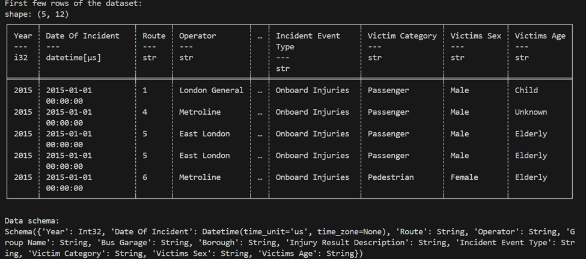
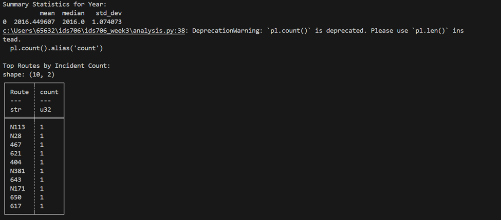
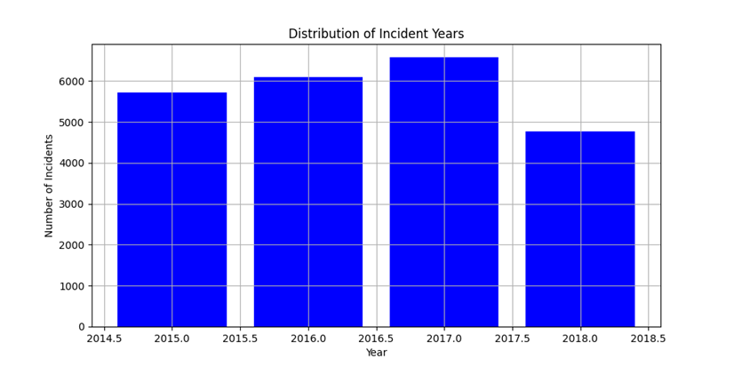
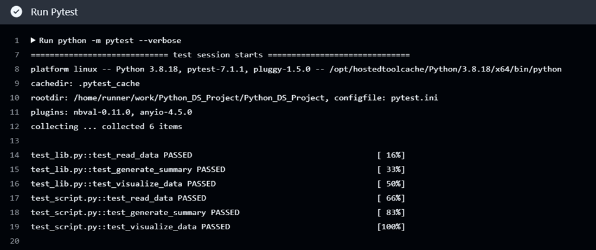
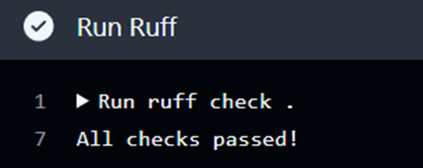
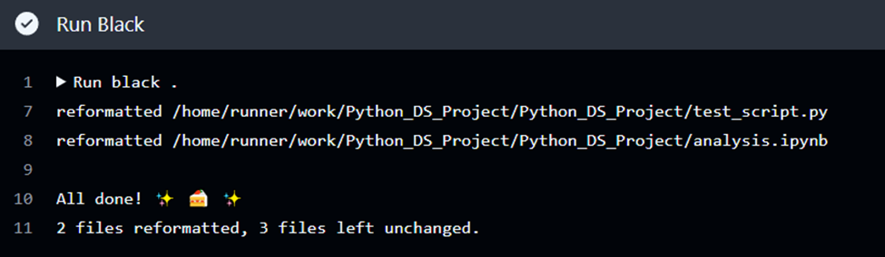

# Project #1: Continuous Integration for Python Data Science

This project demonstrates a robust setup for a Python data science project using continuous integration with GitHub Actions to ensure code quality and functionality.

## Project Structure

- `analysis.ipynb`: Jupyter notebook containing cells that perform descriptive statistics. This can use either Pandas depending on the project specifics.
- `Makefile`: Automates tasks such as testing, linting, and installing dependencies.
- `test_script.py`: Contains tests for the main Python script.
- `test_lib.py`: Contains tests for utility functions in the library.
- `requirements.txt`: Lists all dependencies with pinned versions to ensure reproducibility.
- `script.py`: Main Python script (if applicable, describe briefly what it does).
- `lib.py`: Python library with functions used across the project.

## Features

- **Descriptive Statistics in Jupyter Notebook**: Analyze data using comprehensive statistical methods provided by Pandas.
- **Testing with nbval**: Ensures that all notebook cells execute correctly using the `nbval` plugin for `pytest`.
- **Continuous Integration**: Utilizes GitHub Actions to automate testing, linting, and other checks.


## Data Description

The dataset TFL Bus Safety.xlsx includes the following columns:

1. Year: The year of the incident.
2. Date Of Incident: The exact date and time of the incident.
3. Route: Bus route number.
4. Operator: The company operating the bus.
Other columns provide detailed information about the incident, including the nature of injuries and the victim's details.


## Summary Statistics
Here are some key summary statistics derived from the analysis:

Year:
Mean: 2016.45
Median: 2016
Standard Deviation: 1.074


## Data Visualization
This histogram shows the distribution of bus safety incidents from 2015 to 2018, illustrating changes in incident frequency over the years.



## Setup Instructions

1. **Clone the Repository**
   ```bash
   git clone <repository-url>
   cd <repository-name>

2. **Install Dependencies**
   ```bash
   make install


3. **Run Tests**
This project uses the following testing approaches:
nbval plugin for pytest: Ensures the Jupyter Notebook's cells execute as expected.
Pytest: Used to run tests defined in test_script.py and test_lib.py.
   ```bash
   make test


4. **Linting**
   ```bash
   make lint


5. **Format Code**
   ```bash
   make format


## Continuous Integration Status
[](https://github.com/iikikk/Python_DS_Project/actions/workflows/install.yml)

[](https://github.com/iikikk/Python_DS_Project/actions/workflows/format.yml)

[](https://github.com/iikikk/Python_DS_Project/actions/workflows/lint.yml)

[](https://github.com/iikikk/Python_DS_Project/actions/workflows/test.yml)

## Detailed Description of Project Components

### `analysis.ipynb`
- **Purpose**: This Jupyter Notebook is central to the data analysis process, featuring cells that execute descriptive statistics using the Pandas library. It is structured to provide insights into the dataset through a series of transformations and visualizations.
- **Testing**: The notebook is integrated with the nbval plugin for pytest to ensure that all cells execute correctly and the output remains consistent over time, which is crucial for reproducibility and integrity of results.

### `script.py`
- **Purpose**: This Python script extends the functionalities defined in `lib.py` to apply data processing and visualization tasks in a scriptable environment, allowing for automation and repetitive execution without manual intervention.
- **Integration**: Works in conjunction with `lib.py` to utilize common functions, ensuring consistency across the script and the notebook.

### `lib.py`
- **Purpose**: Serves as a utility module for the project, containing functions that are shared between the Jupyter Notebook and the Python script. Functions include data loading, data cleaning, computation of summary statistics, and data visualization.
- **Benefits**: Promotes code reusability and maintainability by centralizing common logic, reducing redundancy, and simplifying updates.

### `Makefile`
- **Purpose**: The Makefile is designed to streamline common development and deployment tasks.
  - `make install`: Installs all the dependencies listed in `requirements.txt`.
  - `make test`: Runs comprehensive tests across the notebook, script, and library using pytest to ensure functionality across all components.
  - `make format`: Automatically formats all Python code in the project using Black to adhere to coding standards.
  - `make lint`: Lints the code using Ruff to identify and fix potential errors and enforce style guidelines.

### `test_script.py`
- **Purpose**: Contains automated tests for `script.py`, ensuring that each function performs as expected under predefined conditions. This script is crucial for validating the correctness of the script's operations.

### `test_lib.py`
- **Purpose**: Tests the functions within `lib.py`, verifying their accuracy and stability. This is essential for ensuring that changes in the utility functions do not introduce bugs into the notebook or script.

### `requirements.txt`
- **Purpose**: Lists all necessary Python packages with specific versions to ensure that the project can be accurately reproduced on any setup. This file is crucial for maintaining a consistent environment across different development and production settings.
